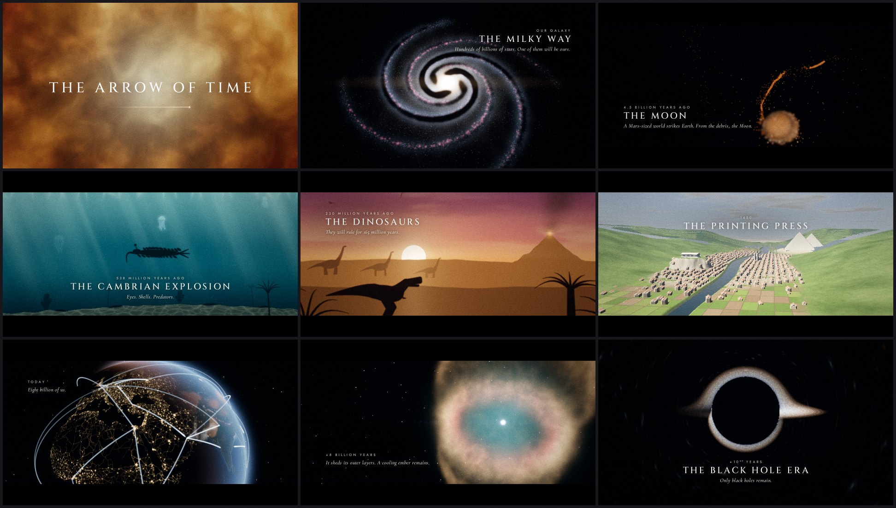

# Movies

A code-driven studio for cinematic, procedurally animated films. Every frame is rendered by
WebGL2 shaders and every note of the score is synthesized in Python, so a film is just source
code: diffable, reproducible, and renderable on any machine (GPU or not).

**Featured film: [The Arrow of Time](projects/arrow-of-time/)** is the history and future of
everything, from the Big Bang through the Earth, life and humanity to the heat death of the
universe, in 5 minutes 18 seconds.



Watch: the latest cut is on the [Releases page](https://github.com/abhishekpradhan/movies/releases)
(1080p, a 720p preview and a poster).

## Quick start

Requirements: Node 20+, Python 3.10+, ffmpeg, and Chromium for Playwright.

```bash
npm install
npm run setup                            # Python venv for the audio, Playwright's Chromium, ffmpeg check

npm run dev                              # interactive preview at http://localhost:5173
npm run audio -- arrow-of-time           # synthesize the score -> out/arrow-of-time/audio/score.wav
npm run render -- arrow-of-time          # 1080p24 film -> out/arrow-of-time/renders/
```

## Commands

| Command | What it does |
|---|---|
| `npm run dev` | Preview player: scrub the timeline, play with the soundtrack, step frames (`Space`, `←/→`, `[`/`]` jump between shots). `?s=1` renders at full resolution, `?mb=1` enables motion blur. |
| `npm run still -- <id> --t 12.5 [--t 30 ...]` | Render PNG stills to `out/<id>/stills/`. Add `--grid` to tile them into one image. |
| `npm run still -- <id> --shot <shotId>` | Contact sheet of frames spread across one shot. |
| `npm run still -- <id> --sheet --from 0 --to 80 --n 40 --cols 8` | Contact sheet of a whole time range. |
| `npm run still -- <id> --t 10 --t 20 --bench --scale 1` | Per-frame render cost, for planning renders. |
| `npm run still -- <id> --t 73 --textonly` | Captions only, over black, without grain or bloom: for checking typography. |
| `npm run render -- <id> [--preset draft\|final]` | Render the film. `draft` is half resolution, fast x264 and no motion blur. Rendering is split into 20 s segments that workers pull from a queue; an interrupted render continues with `--resume`. Also takes `--from/--to` seconds, `--workers n`, `--segment s`, `--crf`, `--scale`, `--gl auto\|egl\|vulkan\|swiftshader\|gpu` and `--no-audio`. |
| `npm run release -- <id> [--variants 1080p,720p,poster]` | Make the distribution encodes of the latest final render in `out/<id>/release/`: a two-pass 1080p encode at 8 Mbps (`--mbps`), a 720p preview sized to fit `--preview-mb` (default 28), a poster frame, `info.json` and `SHA256SUMS` (`2160p` from a 4K master). Publish them as a GitHub Release. |
| `npm run audio -- <id>` | Run `projects/<id>/score.py` and write `out/<id>/audio/score.wav`. |
| `npm run new -- <id> --title "My Film"` | Scaffold a new film from `templates/starter`. |
| `npm run setup` | One-time setup: creates `.venv` with the audio dependencies, installs Playwright's Chromium, checks for ffmpeg. |
| `npm run typecheck` | TypeScript check of the engine, tools and all projects (CI runs it on every push). |

## How a film is made

1. **Timeline first.** `projects/<id>/timeline.json` holds every beat (start/end, captions) and
   every sync cue (hits, flashes, ignitions). Both the visuals (`project.ts`) and the music
   (`score.py`) read it, so retiming a beat moves the picture, the text and the score together.
2. **Shots.** A shot is a time span plus a `render(ctx)` function that draws HDR light into a
   render target: full-screen GLSL, instanced sprites, or both. Overlapping shots dissolve (`fadeIn`/
   `fadeOut`), and each shot can ask for motion blur (sub-frame accumulation).
3. **Look.** `project.look(t)` animates the post chain over time: exposure kicks, white flashes,
   camera shake, the 2.39:1 letterbox (which opens to full frame for "IMAX" moments), bloom,
   anamorphic streaks, grading, grain and vignette.
4. **Type.** Captions are text items (per-letter reveals, blur-ins, tracking drift,
   superscripts like `10^40`) composited after tonemapping. Glyphs come from a sub-pixel sprite
   cache, so slow drifts never jitter. Each beat places its card in the shot's negative space
   (`layout` in `timeline.json`).
5. **Score.** `score.py` uses the `audio/studio` synthesizer (organ, strings, piano, synth brass,
   bells, choir, drums, booms, risers, clock) with convolution reverb and loudness mastering.
6. **Review loop.** Render stills and contact sheets constantly, and look at them before
   committing to a full render.
7. **Render.** Headless Chromium renders frames and streams raw RGBA into ffmpeg (x264,
   Rec.709-tagged), then the soundtrack is muxed in.

## Architecture

```
engine/                 WebGL2 film engine (TypeScript, browser)
  core/engine.ts        frame renderer: shots -> HDR composite -> motion blur -> post -> canvas
  core/types.ts         Project / Shot / Look contracts
  core/anim.ts, math.ts keyframes, easing, envelopes, drift/shake, vectors, matrices, seeded RNG
  core/camera.ts        look-at camera shared by sprites and ray-marched shaders
  gl/                   programs with reflected uniforms, render targets, 3D textures, #include
  post/post.ts          bloom (13-tap down / tent up), streaks, ACES/AgX/neutral, grade, grain, letterbox
  text/                 typography layer and caption builders
  components/           sprites (instanced, flux-conserving: stars, dust, particles), planet (any era
                        of Earth, Mars, the Moon), galaxy (rotating barred spiral)
  shaders/*.glsl        common, noise (value/gradient/fbm/ridged/Worley/warp), color, sdf, stars,
                        camera, creatures and structures (silhouette SDFs: trilobites to people,
                        huts to rockets)
  runtime/              preview player (index.html) and headless renderer (render.html)
audio/studio/           Python synthesizer, effects, theory, mastering (see audio/README.md)
tools/                  render, still, audio and new-project CLIs, plus asset builders
assets/earth/           Earth maps generated from Natural Earth (see assets/earth/README.md)
templates/starter/      skeleton copied by `npm run new`
projects/<id>/          one folder per film: timeline.json, project.ts, shots/, score.py
out/                    renders, stills, audio (git-ignored)
```

### Rendering without a GPU

On Linux machines without a GPU the renderer uses Chromium's ANGLE on Mesa llvmpipe over EGL
(`--gl egl`). On a 4-core CPU that is about 3x faster than SwiftShader and good for roughly
2–5 frames per second at 1080p on typical shots. With a GPU (`--gl gpu`, the default on macOS
and Windows) everything is much faster. Tips:

- Shader programs compile lazily; LLVM compiles big shaders on first use (up to a few
  seconds per program, once).
- Render soft, noisy layers (nebulae, volumes) into a half-resolution target and composite.
- Keep text on the CPU canvas. Canvas `filter: blur()` on software GL costs seconds per frame,
  so the text layer blurs with the shadow path instead.

## License

- **Code** (the engine, tools, audio synthesizer and templates): [Apache License 2.0](LICENSE).
  Keep the [`NOTICE`](NOTICE) file with copies and forks, and mark files you change.
- **Films** (each `projects/<id>/` folder and its released renders):
  [CC BY 4.0](LICENSES/CC-BY-4.0.txt). Re-cut them, remix them, translate them, use them,
  with credit. For *The Arrow of Time*: "*The Arrow of Time* by Abhishek Pradhan,
  https://github.com/abhishekpradhan/movies, CC BY 4.0", plus a note of what you changed
  (details in [its LICENSE.md](projects/arrow-of-time/LICENSE.md)).
- **Third-party** snippets, data and fonts, with their licenses:
  [THIRD_PARTY_NOTICES.md](THIRD_PARTY_NOTICES.md). Earth maps derive from
  [Natural Earth](https://www.naturalearthdata.com/) (public domain); the fonts (Cinzel, Jost,
  Cormorant Garamond, via [Fontsource](https://fontsource.org/)) are under the SIL Open Font
  License. All imagery and music are generated by this code.

Contributions are welcome: see [CONTRIBUTING.md](CONTRIBUTING.md).
