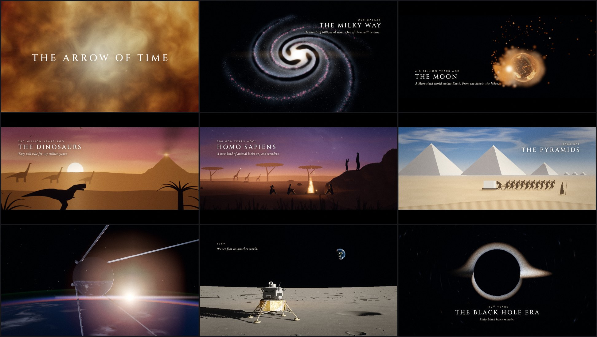

<div align="center">

# The Arrow of Time

**The history and future of everything, from the first instant to the last.**

A six-minute film made entirely in code: every frame is rendered by shaders in a small WebGL2
engine, and every note of the score is synthesized in Python.

[](https://github.com/abhishekpradhan/the-arrow-of-time/actions/workflows/ci.yml)
[](film/LICENSE.md)
[](LICENSE)
[](https://buymeacoffee.com/abhishekpradhan)



**[Watch the film](https://github.com/abhishekpradhan/the-arrow-of-time/releases/latest)**
(1080p, a 720p preview and a poster, on the Releases page)

</div>

## The film

Time has one direction. The film follows it from the Big Bang to the heat death of the
universe, paced by a ticking clock: it falls silent in the Big Bang, accelerates through human
history, stops dead at **Now**, then resumes and slows as the stars die, until its last tick.

| Time | Chapter | |
| --- | --- | --- |
| 0:00 | Prologue | "Everything that has ever happened…", a single point of light gathering energy |
| 0:20 | The Universe | the Big Bang, inflation, the first elements, first light |
| 0:50 | Cosmic Dawn | the dark ages, the first stars, galaxies, the Milky Way |
| 1:20 | The Sun and Earth | a collapsing nebula, the young Sun, a molten Earth, the impact that makes the Moon, the first oceans |
| 2:00 | Life | the first cells, the Great Oxidation, Snowball Earth, the Cambrian seas, onto land, the dinosaurs, the asteroid |
| 2:46 | Humanity | mammals at dawn, the first people at dusk on the savanna, hand stencils in a cave |
| 3:06 | Civilization | twelve thousand years as one day: the first harvest, Uruk, cuneiform, Giza, Athens, Gutenberg's press, the railway, the Wright Flyer, Trinity |
| 3:31 | The Space Race | the R-7 lifting Sputnik through the clouds into an orbital sunrise; Apollo 11 on the Sea of Tranquility, and Armstrong's own voice; the Earth at night |
| 4:12 | Now | the pale blue dot, and silence |
| 4:20 | The Future | new worlds, drifting constellations, the oceans boil away, the red giant, the white dwarf, the Milky Way and Andromeda |
| 5:06 | The End | the last stars, the black hole era, evaporation, the end of time |
| 5:40 | Epilogue | "That moment is now." |

## How it was made

- **Everything is code.** No footage, stock or samples: ray marching, particle sprites and painted
  silhouettes make every frame, and a small synthesizer makes every sound. The one recording is
  NASA's own, of Neil Armstrong calling Houston from Tranquility Base.
- **Real science and history where it counts.** The Moon forms in a smoothed-particle
  hydrodynamics simulation run for the film (SWIFT, 61,139 particles). Today's Earth comes from
  Natural Earth maps, and the Big Dipper drifts on its Hipparcos proper motions. The rocket under
  the 1957 card is the R-7 that carried Sputnik, and Eagle comes down under a Sun ten degrees up,
  as it did on 20 July 1969.
- **One source of timing.** [`film/timeline.json`](film/timeline.json) holds the script, the
  captions and every cue. The shots, the captions and the score all read it, so moving a beat moves
  the picture, the text and the music together.
- **A score you can check without listening.** Organ, strings, piano, synth brass, bells, choir
  and drums with convolution reverb, mastered to -14 LUFS. CI renders it on every push and checks
  its hits and cuts against the timeline.
- **Cinematic post.** HDR rendering, bloom, anamorphic streaks, light shafts, ACES tonemapping,
  grading, grain, motion blur, and a 2.39:1 letterbox that opens to full frame for the biggest
  moments.
- **Renders anywhere.** Headless Chromium on a GPU, Mesa llvmpipe on a plain CPU, or dozens of
  containers at once [on Modal](docs/modal.md) for minutes and about a dollar.

The [making-of](docs/making-of.md) goes scene by scene, and [the score](docs/score.md) explains
the music.

## Build it yourself

You need Node 20+, Python 3.10+ and ffmpeg ([details per platform](docs/getting-started.md)).

```bash
git clone https://github.com/abhishekpradhan/the-arrow-of-time.git
cd the-arrow-of-time
npm install
npm run setup        # Python venv for the score, Playwright's Chromium, ffmpeg check

npm run dev          # interactive preview at http://localhost:5173
npm run audio        # synthesize the score -> out/audio/score.wav
npm run render       # render the film      -> out/renders/the-arrow-of-time-final-latest.mp4
```

With a GPU the final 1080p render takes about half an hour; on a CPU alone it takes several
hours, which is what [Modal](docs/modal.md) is for.

| Command | What it does |
| --- | --- |
| `npm run dev` | Preview player: scrub, play with sound, step frames (`Space`, `←`/`→`, `[`/`]` between shots). `?s=1` renders at full resolution, `?mb=1` adds motion blur. |
| `npm run still -- --t 12.5 [--t 30 ...] [--grid]` | Still frames as PNGs. `--sheet --from 0 --to 80 --n 40` makes a contact sheet, `--bench --scale 1` measures the cost of a frame, `--textonly` shows the captions over black. |
| `npm run render [-- --preset draft]` | Render the film (resumable with `--resume`; `--from/--to` or `--frames a:b` render a range). |
| `npm run audio [-- --from s --to s]` | Synthesize the score (a window renders in seconds). |
| `npm run release` | Distribution encodes of the latest render: 1080p, a 720p preview, a poster and checksums. |
| `npm run typecheck` | Type-check the engine, the film and the tools. |

## What's in this repository

```text
film/      the film: timeline.json (script, captions, cues), project.ts, shots/, shaders/,
           text.ts (captions), score.py (the score)
engine/    the WebGL2 film engine it runs on (TypeScript): renderer, camera, post, text,
           components (planets, galaxies, an atmosphere) and a GLSL library
audio/     the Python synthesizer, mastering and analysis the score is written with
tools/     render, still, audio and release CLIs; the Modal pipeline; asset builders
assets/    data the film loads: Earth maps, the giant-impact simulation, NASA's Apollo 11 audio
docs/      the making-of, the score, and guides to working on, rendering and releasing the film
out/       renders, stills and audio (git-ignored)
```

```text
timeline.json ──► project.ts ──► shots (GLSL, sprites, ray marching) ──► HDR composite ──► post ──► frame
      │                 └──────► captions (glyph cache, per-beat layout) ─────────────────────┘
      └──────────────► score.py ──► audio/studio synth ──► mix ──► master ──► score.wav ──┐
                                                                                          ▼
                      headless Chromium ──► raw RGBA ──► ffmpeg (x264) ──────────────► film.mp4
```

| Guide | What it covers |
| --- | --- |
| [Getting started](docs/getting-started.md) | Install, preview, render, troubleshooting |
| [The making of](docs/making-of.md) | How each scene is made, and the science and history behind it |
| [The score](docs/score.md) | The music's design and its cue sheet |
| [Working on the film](docs/working-on-the-film.md) | The timeline, shots, captions, look and score, and the review loop |
| [The engine](docs/engine.md) | Shots, camera, sprites, planets, galaxies, the atmosphere, shader includes, post, text |
| [Audio](audio/README.md) | The synthesizer, mixing, mastering, and verifying a score without listening |
| [Rendering](docs/rendering.md) | Presets, GPU and CPU rendering, performance, 4K |
| [Rendering on Modal](docs/modal.md) | Parallel cloud renders, caching, costs, the GitHub workflow |
| [Releasing](docs/releasing.md) | Distribution encodes and GitHub Releases |
| [CLAUDE.md](CLAUDE.md) | Conventions and hard-won pitfalls, for people and AI assistants alike |

## Contributing

Notes on the film are as welcome as code: a shot that could be better, a caption that reads
wrong, a scientific or historical detail (with a source, ideally). Use the
[issue forms](https://github.com/abhishekpradhan/the-arrow-of-time/issues/new/choose). Fixes and
improvements to the engine, the tools and the synthesizer are welcome too, and so are re-cuts,
translations and remixes of the film under its license. See [CONTRIBUTING.md](CONTRIBUTING.md), the
[Code of Conduct](CODE_OF_CONDUCT.md) and [SECURITY.md](SECURITY.md). Changes are listed in the
[CHANGELOG](CHANGELOG.md).

## Credits and license

*The Arrow of Time* is by Abhishek Pradhan. If it moved you, you can
[buy me a coffee](https://buymeacoffee.com/abhishekpradhan).

- **The film** (the video and its soundtrack, stills, and the words it speaks) is licensed under
  [CC BY 4.0](film/LICENSE.md). Share it, re-cut it, translate it, remix it, commercially too,
  with credit: "*The Arrow of Time* by Abhishek Pradhan,
  https://github.com/abhishekpradhan/the-arrow-of-time, CC BY 4.0".
- **The code**, all of it (the engine, the tools, the synthesizer, and the film's shots, shaders
  and score code), is licensed under the [MIT License](LICENSE). Build on it.
- **Borrowed with thanks**: the Apollo 11 air-to-ground audio, courtesy of NASA (not covered by
  the film's license); Earth maps from [Natural Earth](https://www.naturalearthdata.com/) (public
  domain); star positions from ESA's Hipparcos catalogue; the Moon-forming impact simulated with
  SWIFT, WoMa and SEAGen; shader and DSP snippets by Inigo Quilez, Dave Hoskins and others (MIT);
  and the typefaces Cinzel, Jost, Cormorant Garamond and UnifrakturMaguntia (SIL Open Font
  License). Details are in [THIRD_PARTY_NOTICES.md](THIRD_PARTY_NOTICES.md).
